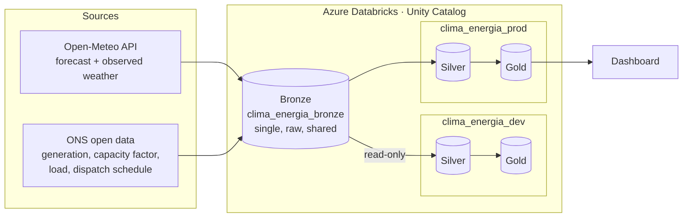
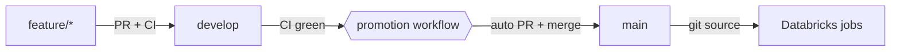

# Weather × Renewable Energy — Brazil's Northeast

> **Status:** infrastructure decommissioned on 2026-10-09 (end of Azure trial credits); everything is reproducible from this repository. See [Results](#results).

[](https://github.com/amandapgs-dataeng/clima-energia-datapipeline/actions/workflows/ci.yml)


🇧🇷 [Leia em português](README.pt-BR.md)

End-to-end data engineering project that ingests **weather data** (Open-Meteo) and **power
system data** from Brazil's grid operator (ONS) to study how weather drives **wind and solar
generation in Brazil's Northeast** — the region that produces most of the country's wind power.

Everything is code: infrastructure, permissions, jobs and the delivery pipeline are versioned,
tested and promoted automatically.

## Architecture



| Layer | Question it answers | Scope |
|---|---|---|
| **Bronze** | What did the source send? | One copy for all environments. Exact copy of the source, no business rules. |
| **Silver** | Is the data reliable, clean and standardized? | Per environment. Deduplication, typing, a shared vocabulary across sources, quality checks. |
| **Gold** | What does it mean for the business? | Per environment. Aggregations that answer the business questions. |

## Engineering highlights

- **Infrastructure as code, end to end.** Azure resource group, ADLS Gen2, Databricks workspace,
  Unity Catalog (storage credential, external locations, catalogs, schemas, grants), jobs and a
  budget alert are all Terraform. State lives in a remote Azure backend with locking,
  versioning and soft delete.
- **Environments with real isolation.** Dev and prod have separate catalogs for silver and gold.
  Dev runs as its own service principal with `SELECT`-only access to bronze, so a bug in dev
  cannot touch the raw data.
- **A single, source-faithful bronze layer.** Data is ingested once, complete and free of
  business rules, and shared across environments. Filters live in silver, so fixing one only
  takes a reprocess, not a new ingestion.
- **CI/CD with a quality gate.** Every change goes through a pull request to `develop`, where
  CI runs the unit tests, a secret scan (gitleaks) and `terraform fmt`/`validate`. When CI
  passes, a workflow promotes `develop` to the protected `main` branch automatically, and
  production jobs pull code from `main`.
- **Defensive ingestion.** HTTP retries with exponential backoff and timeouts, structured
  logging, and an audit log that records failures as well as successes. The job still fails
  loudly and sends an alert.
- **Cost control.** Jobs run on ephemeral single-node job clusters, the silver runs on serverless
  compute only when the bronze changes, and a monthly budget alert watches spending. In steady
  state the project costs around R$ 10/day, about R$ 6 of which is the fixed cost of the NAT
  gateway that secure cluster connectivity (no public IPs on clusters) requires.

## What the data profiling found

Before writing any transformation, the bronze layer was profiled
([bronze data dictionary](docs/dicionario_bronze.md)). Some findings that shape the silver layer:

- **ONS timestamps are local time labeled as UTC.** Solar output starts at 06:00 and ends at
  17:00, which is only plausible in local time. Treating them as UTC would shift every join
  with weather data by 3 hours.
- **The same concept has different names across datasets:** `EOLIELÉTRICA` vs `Eólica`,
  `TIPO I` vs `Tipo I`.
- **Some "duplicates" are not duplicates.** Hybrid wind+solar plants appear twice per hour.
  Plants can share a regulatory code (`ceg`), and aggregated plants use `-` as a placeholder
  code. The natural keys had to be discovered, not assumed.
- **Re-ingestion is history, not noise.** Grid load is re-read over a rolling 60-day window
  every week, so the ONS can revise past values. Silver keeps the version history.

## Results

Gold layer, Brazil's Northeast, 10/2024–09/2026 ([exported tables](docs/resultados/)).

**1. How much of the installed capacity becomes energy?** Wind farms reach a **44.7%**
capacity factor in the windy season (Jul–Oct) against **28.7%** from January to April: the
season almost doubles wind output (peak 49.5% in 09/2025, low 22.2% in 02/2026). Solar stays
around **20.9%** all year.

**2. Does the weather at the plants explain generation?** Yes. The empirical wind power curve
rises from 13% at 2 m/s to 41% at 6 m/s and saturates near **50% above 11 m/s**. Correlation
with generation is **0.61** for wind at 100 m (0.39 to 0.81 depending on the state) and **0.65**
for solar radiation. Temperature correlates *negatively* with wind output (−0.40): in the
Northeast, the wind blows harder at night.

**3. How much forecast generation was not scheduled?** The gap between the generation the grid
operator forecast and what it scheduled grew from **4.8%** in April to **15.6%** in September
2026: **10.2 TWh** in six months, concentrated in the windy season. (Brazil-wide indicator:
91% of wind capacity is in the Northeast; it is not the official curtailment measure.)

**4. Are the forecasts accurate?** Hour by hour and plant by plant, the operator's schedule
misses actual generation by **32%** (wind) and **40%** (solar), with almost no bias in the total.
The day-ahead weather forecast misses wind at 100 m by **3.6 km/h** (mean wind 21 km/h) and
temperature by **0.74 °C**.

**Bonus.** Daily load in the Northeast correlates **0.51** with the capitals' temperature
(association, not causation: season and calendar also matter), and is **7.7% lower** on weekends.

## Project status

The Azure infrastructure was **decommissioned on 2026-10-09**, when the trial credits ended. Code,
infrastructure, dashboards (as code), data dictionaries and the exported gold results remain in
this repository. To rebuild everything from scratch:

```bash
./infra/bootstrap/criar_backend_state.sh          # remote state storage
cd infra && terraform init && terraform apply     # infrastructure, pipelines, jobs and dashboards
# then run the job reprocessamento-clima-energia with the desired periods (backfill)
```

## Repository layout

```
.github/workflows/   CI (tests, gitleaks, terraform) and automatic promotion to main
infra/               Terraform: Azure + Databricks + Unity Catalog + jobs
  bootstrap/         One-time script that creates the remote-state storage
notebooks/           Databricks notebooks (ingestion)
pipelines/silver/    Lakeflow Declarative Pipeline for the silver layer
pipelines/gold/      Lakeflow Declarative Pipeline for the gold layer (business metrics)
  utils/             Shared, unit-tested helpers (dates, HTTP, logging, bronze writes)
tests/               pytest suite (helpers without Spark; silver transformations on local Spark)
dashboards/          Databricks AI/BI dashboards as code (generated by construir.py, published by Terraform)
docs/                Data dictionaries (bronze, silver, gold) and design decisions
migracoes/           One-off data migrations (SQL)
```

## Delivery flow



## Running it

Prerequisites: Azure CLI (logged in), Terraform ≥ 1.7, Python 3.12.

```bash
# 1. One time only: create the storage for the Terraform state
./infra/bootstrap/criar_backend_state.sh

# 2. Infrastructure
cd infra
cp terraform.tfvars.example terraform.tfvars   # fill in the alert e-mail
terraform init
terraform apply

# 3. Tests
pip install -r requirements-dev.txt
pytest
```

## Roadmap

- [x] Infrastructure as code, dev/prod environments, least-privilege access
- [x] CI/CD with quality gate and automatic promotion
- [x] Bronze ingestion (6 datasets, 2 providers), profiling and data dictionary
- [x] Silver: 6 tables with deduplication, version history, typing, a shared vocabulary and
  data quality expectations ([silver data dictionary](docs/dicionario_silver.md))
- [x] Gold: 9 tables answering the business questions ([gold data dictionary](docs/dicionario_gold.md))
- [x] Dashboards: business results and pipeline monitoring (Databricks AI/BI, as code)

## Conventions

- Branches: `feature/*`, `fix/*`, `docs/*`, `chore/*` → PR to `develop`.
- Commits follow [Conventional Commits](https://www.conventionalcommits.org/)
  (`feat:`, `fix:`, `docs:`, `chore:`, `refactor:`, `test:`, `ci:`).
- Code and docs are written in Portuguese; this README is bilingual.
