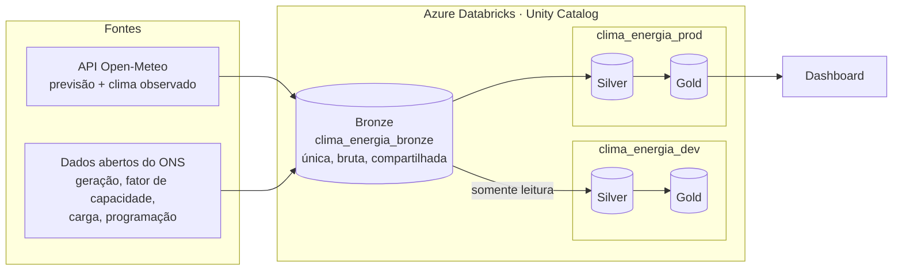
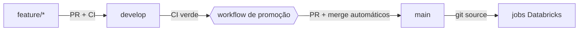

# Clima × Energia Renovável — Nordeste

> **Situação:** infraestrutura desativada em 09/10/2026 (fim dos créditos de avaliação do Azure); tudo é reproduzível a partir deste repositório. Veja os [Resultados](#resultados).

[](https://github.com/amandapgs-dataeng/clima-energia-datapipeline/actions/workflows/ci.yml)


🇺🇸 [Read in English](README.md)

Projeto de engenharia de dados de ponta a ponta que ingere **dados de clima** (Open-Meteo) e
**dados do sistema elétrico** do Operador Nacional do Sistema (ONS) para estudar como o clima
influencia a **geração eólica e solar no Nordeste**, a região que produz a maior parte da
energia eólica do país.

Tudo é código: infraestrutura, permissões, jobs e a esteira de entrega são versionados,
testados e promovidos automaticamente.

## Arquitetura



| Camada | Pergunta que responde | Escopo |
|---|---|---|
| **Bronze** | O que a fonte mandou? | Uma cópia para todos os ambientes. Cópia fiel da fonte, sem regra de negócio. |
| **Silver** | O dado é confiável, limpo e padronizado? | Por ambiente. Deduplicação, tipagem, vocabulário comum entre fontes, checagens de qualidade. |
| **Gold** | O que isso significa para o negócio? | Por ambiente. Agregações que respondem às perguntas de negócio. |

## Destaques de engenharia

- **Infraestrutura como código, de ponta a ponta.** Resource group, ADLS Gen2, workspace
  Databricks, Unity Catalog (credencial, external locations, catalogs, schemas, permissões),
  jobs e alerta de orçamento, tudo em Terraform. O state fica num backend remoto no Azure, com
  lock, versionamento e soft delete.
- **Ambientes com isolamento real.** Dev e prod têm catalogs separados para silver e gold. Dev
  roda com um service principal próprio, que só tem `SELECT` na bronze. Um bug em dev não
  consegue tocar o dado bruto.
- **Bronze única e fiel à fonte.** O dado é ingerido uma vez, completo e sem regras de negócio,
  e compartilhado pelos ambientes. Os filtros ficam na silver: corrigir um filtro exige só
  reprocessar, sem nova ingestão.
- **CI/CD com portão de qualidade.** Toda mudança passa por um PR para a `develop`, onde o CI
  roda os testes unitários, uma varredura de segredos (gitleaks) e `terraform fmt`/`validate`.
  Com o CI verde, um workflow promove a `develop` para a `main` protegida automaticamente. Os
  jobs de produção leem o código da `main`.
- **Ingestão defensiva.** Retry HTTP com backoff exponencial e timeout, logging estruturado e um
  log de auditoria que registra falhas além de sucessos. O job continua falhando de forma
  visível e mandando alerta.
- **Controle de custo.** Os jobs rodam em clusters de job efêmeros, de um nó só, a silver roda em
  compute serverless só quando a bronze muda, e um alerta de orçamento mensal acompanha o gasto.
  Em operação normal, o projeto custa cerca de R$ 10 por dia; uns R$ 6 são o custo fixo do NAT
  gateway exigido pela conectividade segura dos clusters (sem IP público).

## O que o profiling do dado revelou

Antes de escrever qualquer transformação, a bronze foi perfilada
([dicionário da bronze](docs/dicionario_bronze.md)). Alguns achados que definem a silver:

- **O horário do ONS é local, mas vem rotulado como UTC.** A geração solar começa às 6h e
  termina às 17h, o que só é plausível em horário local. Tratar como UTC deslocaria em 3 horas
  todo cruzamento com o clima.
- **O mesmo conceito tem nomes diferentes entre datasets:** `EOLIELÉTRICA` × `Eólica`,
  `TIPO I` × `Tipo I`.
- **Algumas "duplicatas" não são duplicatas.** Usinas híbridas (eólica + solar) aparecem duas
  vezes por hora. Usinas podem compartilhar o código regulatório (`ceg`), e usinas agregadas
  usam `-` como código. As chaves naturais precisaram ser descobertas, não supostas.
- **Reingestão é histórico, não ruído.** A carga é relida numa janela móvel de 60 dias toda
  semana, e o ONS pode revisar valores passados. A silver guarda o histórico de versões.

## Resultados

Camada gold, Nordeste, 10/2024 a 09/2026 ([tabelas exportadas](docs/resultados/)).

**1. Quanto da capacidade instalada vira energia?** As eólicas chegam a **44,7%** de fator de
capacidade na safra dos ventos (julho a outubro), contra **28,7%** de janeiro a abril: a safra
quase dobra a geração eólica (pico de 49,5% em 09/2025, mínimo de 22,2% em 02/2026). A solar fica
perto de **20,9%** o ano todo.

**2. O clima no local das usinas explica a geração?** Sim. A curva de potência real sobe de 13%
com vento de 2 m/s para 41% com 6 m/s e satura perto de **50% acima de 11 m/s**. A correlação com
a geração é de **0,61** para o vento a 100 m (de 0,39 a 0,81, conforme o estado) e de **0,65**
para a radiação solar. A temperatura tem correlação *negativa* com a eólica (−0,40): no Nordeste,
venta mais à noite.

**3. Quanto da geração prevista deixou de ser programada?** A diferença entre a geração que o ONS
previu e a que programou cresceu de **4,8%** em abril para **15,6%** em setembro de 2026:
**10,2 TWh** em seis meses, concentrados na safra dos ventos. (Indicador do Brasil: 91% da
capacidade eólica fica no Nordeste; não é a medição oficial de cortes.)

**4. As previsões acertam?** Hora a hora e usina a usina, a programação do ONS erra a geração real
em **32%** (eólica) e **40%** (solar), quase sem viés no total. A previsão do tempo feita na
véspera erra o vento a 100 m em **3,6 km/h** (vento médio de 21 km/h) e a temperatura em
**0,74 °C**.

**Bônus.** A carga diária do Nordeste tem correlação de **0,51** com a temperatura das capitais
(associação, não causalidade: estação do ano e calendário também influenciam) e é **7,7% menor**
nos fins de semana.

## Situação do projeto

A infraestrutura no Azure foi **desativada em 09/10/2026**, com o fim dos créditos de avaliação.
O código, a infraestrutura, os dashboards (como código), os dicionários de dados e os resultados
exportados da gold continuam neste repositório. Para recriar tudo do zero:

```bash
./infra/bootstrap/criar_backend_state.sh          # storage do state remoto
cd infra && terraform init && terraform apply     # infraestrutura, pipelines, jobs e dashboards
# depois, rode o job reprocessamento-clima-energia com os períodos desejados (backfill)
```

## Estrutura do repositório

```
.github/workflows/   CI (testes, gitleaks, terraform) e promoção automática para a main
infra/               Terraform: Azure + Databricks + Unity Catalog + jobs
  bootstrap/         Script, rodado uma vez, que cria o storage do state remoto
notebooks/           Notebooks Databricks (ingestão)
pipelines/silver/    Lakeflow Declarative Pipeline da camada silver
pipelines/gold/      Lakeflow Declarative Pipeline da camada gold (métricas de negócio)
  utils/             Funções compartilhadas e testadas (datas, HTTP, logging, gravação na bronze)
tests/               Testes com pytest (helpers sem Spark; transformações da silver em Spark local)
dashboards/          Dashboards do Databricks AI/BI como código (gerados por construir.py, publicados pelo Terraform)
docs/                Dicionários de dados (bronze, silver, gold) e decisões de desenho
migracoes/           Migrações de dados pontuais (SQL)
```

## Fluxo de entrega



## Como rodar

Pré-requisitos: Azure CLI (com login feito), Terraform ≥ 1.7 e Python 3.12.

```bash
# 1. Só uma vez: cria o storage do state do Terraform
./infra/bootstrap/criar_backend_state.sh

# 2. Infraestrutura
cd infra
cp terraform.tfvars.example terraform.tfvars   # preencha o e-mail de alertas
terraform init
terraform apply

# 3. Testes
pip install -r requirements-dev.txt
pytest
```

## Roadmap

- [x] Infraestrutura como código, ambientes dev/prod e acesso com privilégio mínimo
- [x] CI/CD com portão de qualidade e promoção automática
- [x] Ingestão na bronze (6 datasets, 2 fontes), profiling e dicionário de dados
- [x] Silver: 6 tabelas com deduplicação, histórico de versões, tipagem, vocabulário comum e
  regras de qualidade ([dicionário da silver](docs/dicionario_silver.md))
- [x] Gold: 9 tabelas que respondem às perguntas de negócio ([dicionário da gold](docs/dicionario_gold.md))
- [x] Dashboards: resultados de negócio e monitoramento do pipeline (Databricks AI/BI, como código)

## Convenções

- Branches: `feature/*`, `fix/*`, `docs/*`, `chore/*` → PR para a `develop`.
- Commits seguem o [Conventional Commits](https://www.conventionalcommits.org/pt-br/)
  (`feat:`, `fix:`, `docs:`, `chore:`, `refactor:`, `test:`, `ci:`).
- O código e a documentação estão em português; o README é bilíngue.
